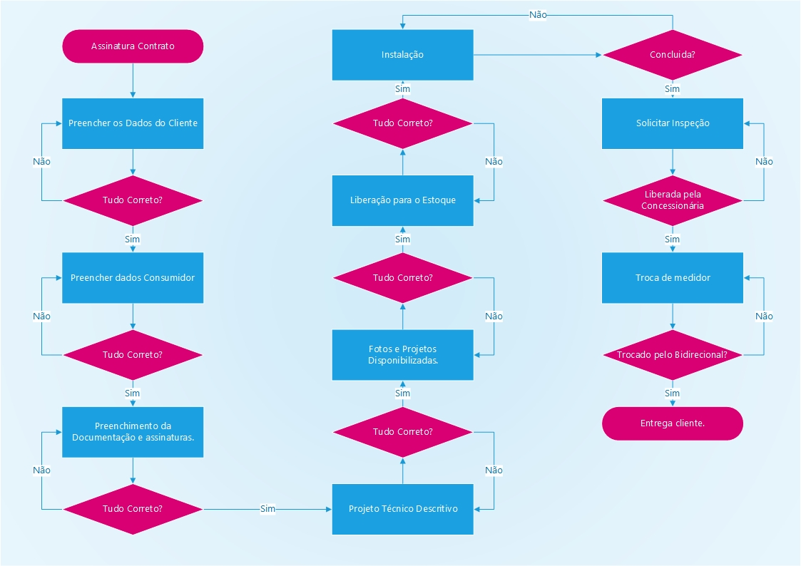

# Requisitos do sistema de ordem de serviço
O problema
As ordens de serviço vem com o intuito de organizar os projetos e clientes a se fazer além de criar uma sequência de projetos e passos a serem sequidos por vários setores que normalmente não se conversam, a tendência de falha de comunicação é bem grande.

## Solução
Criar passos quais podem ser seguidos por todos da empresa afim de facilitar e criar comunicações claras, sobre tudo que temos que fazer. Foram divididos em trópicos, quais cada "Equipe" preenche sua parte, fazendo fiscalização da anterior e disponibilizando para o próximo.

## Sistema
Foi dividido em cada "Subproduto" do projeto em um fluxograma, qual todos precisam seguir.

### Dados Clientes

Nome:

Código UC:

Localização:

CEP:

Bairro:

E-mail:

Telefone:

CPF/CNPJ:

Forma de Pagamento:

Observações:

### Dados Consumidor

Carga Instalada:

Padrão:

Tensão de Atendimento:

Tipo de Conexão: [ ] Monofásico [ ] Bifásico [ ] Trifásico

Potência Instalada:*

Potência Módulos:

Potência do(s) Inversor(es):

N° de Arranjos:

### Documentação

COPIA/2ª VIA DA CONTA:

ART:

ANEXO E:

ANEXO G:

PROCURAÇÃO:

CONTRATO:

CNH OU IDENTIDADE:

CARTÃO CNPJ:

CONTRATO SOCIAL:

ANEXO I:

ANEXO II:

ANEXO IV:

### DOCUMENTOS PROJETO TÉCNICO

Certidão de Registro Profissional

ANEXO F

MEMORIAL DESCRITIVO COM ANEXO

PLANTAS 01,02,03

REGISTRO INMETRO MÓDULOS

REGISTRO INMETRO INVERSOR E EQUIVALÊNCIA

*OBS: Menor carga no Caso da CPFL e Potência dos Módulos para Cermissões
**OBS: Validar Assinaturas iguais aos documentos que irão para consessionária;

### FOTOS

DISJUNTOR GERAL

PADRÃO DE ENTRADA

DISPOSIÇÃO

### QUANTITATIVOS

Módulos

Inversor Monofásico 220 V

Inversor Trifásico 380 V

Monitoramento

Módulo Optimizer

Protetor surto CC

Protetor surto CA

Conector MC4

Cabo CC (m)

Disjuntor CA

String Box CC

Estrutura para telhado

Estrutura para laje

Estrutura para solo fixo

Estrutura para garagem solar

PERFIL LPL 0,55m WEG

PERFIL PLANO

PERFIL PLANO WEG

KIT GRAMPO C/CHAPA INTERM UNIV 35/40mm

GRAMPO FIX TERMINAL 35/40mm WEG

GANCHO FIX C/ PARAFUSO CERAMICA

GRAMPO FIX INTERMED

GRAMPO FIX TERMINAL

PARAFUSO AUTOBROCANTE

FITA DUPLA FACE 30mmX2,5m

GRAMPO FIX TERMINAL 35mm

GRAMPO FIX TERMINAL 40mm

GRAMPO FIX INTERMED 35/40mm

GANCHO FIXAÇÃO ZIPADO

PERFIL REFORÇADO

CONEXAO INTERNA

JUNÇÃO PARA PERFIL H WEG

TRIANGULO 25° PSTRIANGVERTICAL

TRIANGULO 25° PSTRIANGHORIZON
PERFIL

PERFIL UNIVERSAL TIPO H

PARAFUSO DE FIXAÇÃO M10X250mm (madeira)

PARAFUSO DE FIXAÇÃO M10X250mm (metálico)

## Tecnologia Utilizada
A tecnologia escolhida, é uma criação nova para python, utilizando tecnologias, quais faz parecer com o "javascript (Ecmascript)" porém com a facilidade do python, não necessitando de um código diferente, assim utilizaremos a FastApi com SQL para os bancos de dados, irei utilizar as técnologias, para fazer no "Braço".